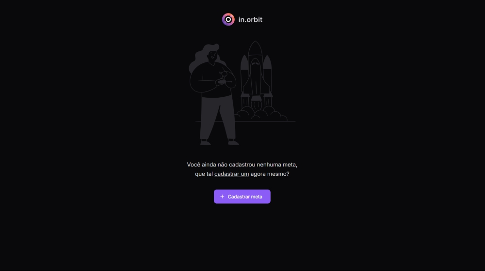

# in.orbit

**Descrição breve do projeto**: Uma aplicação React construída durante o evento **NWL Pocket: JavaScript** da [Rocketseat](https://www.youtube.com/@rocketseat) que visa facilitar o gerenciamento de metas pessoais. Desenvolvido com as melhores práticas em mente e um design responsivo para melhorar a experiência do usuário.



## Índice

1. [Sobre](#sobre)
2. [Funcionalidades](#funcionalidades)
3. [Tecnologias Utilizadas](#tecnologias-utilizadas)
4. [Instalação](#instalação)
5. [Uso](#uso)
8. [Contato](#contato)

## Sobre

Este projeto é uma aplicação React feita para ajudar os usuários a gerenciar e alcançar suas metas pessoais de maneira mais fácil. Com objetivo de incentivá-los a cumprir seus objetivos, oferecendo uma interface simples e intuitiva que ajuda a manter a motivação e o foco no que realmente importa.

## Funcionalidades

- **Funcionalidade 1**: Criação de metas.
- **Funcionalidade 2**: Marcação de metras concluídas no dia.

## Tecnologias Utilizadas

- [**React**](https://react.dev/): Biblioteca JavaScript para construir interfaces de usuário.
- [**Tailwind CSS**](https://tailwindcss.com/): Framework CSS utilitário para estilização rápida e customizada.
- [**Lucide**](https://lucide.dev/): Framework CSS utilitário para estilização rápida e customizada.
- [**Vite**](https://vitejs.dev/): Ferramenta de build que proporciona um ambiente de desenvolvimento rápido para projetos web modernos.
- [**React Hook Form**](https://react-hook-form.com/): Biblioteca para gerenciamento eficiente de formulários e validação em aplicações React.
- [**Zod**](https://zod.dev/): Biblioteca TypeScript-first para validação e definição de esquemas de dados.
- [**Radix UI**](https://www.radix-ui.com/): Conjunto de componentes React não estilizados e acessíveis para construção de interfaces de usuário.
- [**Dayjs**](https://day.js.org/): Biblioteca JavaScript minimalista para manipulação e formatação de datas e horas.
- [**Tanstack Query**](https://tanstack.com/query/latest): Biblioteca para gerenciamento de estado de dados assíncronos, incluindo requisições e cache de dados em aplicações React.
- [**Biome JS**](https://biomejs.dev/pt-br/): Ferramenta para formatação e linting de código JavaScript e TypeScript.

## Instalação

Para rodar este projeto localmente, siga os passos abaixo:

1. **Clone o repositório**:

    ```bash
    git clone https://github.com/rodrigoqueiroz12/in-orbit-react.git
    ```

2. **Acesse o diretório do projeto**:

    ```bash
    cd in-orbit-react
    ```

3. **Instale as dependências**:

    ```bash
    npm install
    ```

4. **Copie o arquivo `.env.example` e crie o `.env`**

5. **Inicie a aplicação**:

    ```bash
    npm run dev
    ```

   Isso irá iniciar o servidor de desenvolvimento e abrir a aplicação no navegador.

**IMPORTANTE**: Para utilizar 100% do projeto, é necessário ter, também, o projeto [in-orbit-node](https://www.github.com/rodrigoqueiroz12/in-orbit-node) executando.

## Uso

Após iniciar o servidor, você pode acessar a aplicação em `http://localhost:5173/`. Navegue pela aplicação e explore suas funcionalidades.

## Contato

Se você tiver dúvidas ou sugestões, sinta-se à vontade para entrar em contato:

- **Nome**: Rodrigo
- **Email**: rodrigo.queiroz0629@gmail.com
- [**LinkedIn**](https://www.linkedin.com/in/rodrigo-queiroz-a113a9212)
- [**GitHub**](https://github.com/rodrigoqueiroz12)
